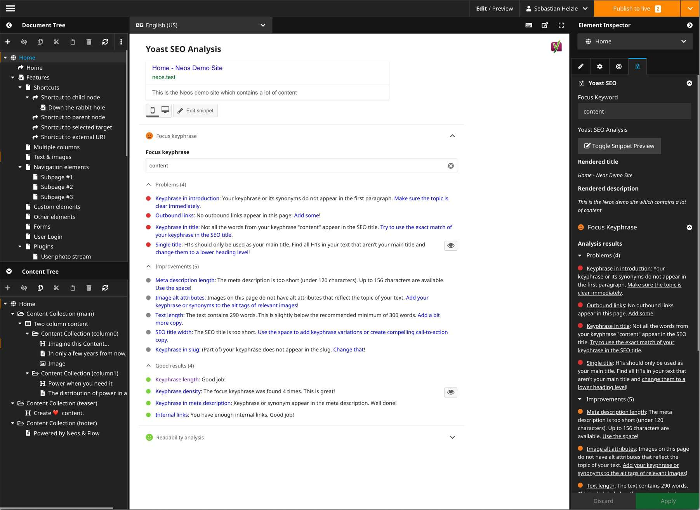
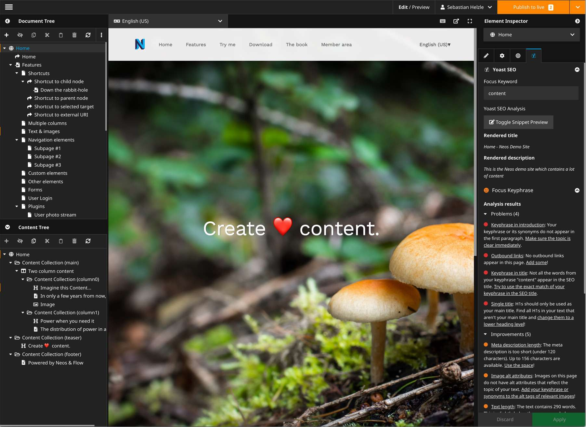

# Yoast SEO integration for Neos CMS

[](https://packagist.org/packages/yoast/yoast-seo-for-neos)
[](https://packagist.org/packages/yoast/yoast-seo-for-neos)
[](https://packagist.org/packages/yoast/yoast-seo-for-neos)
[](https://travis-ci.com/Yoast/Yoast-SEO-for-Neos)

## What does it do

This package provides a new backend preview and inspector integration for [Neos CMS](https://neos.io) to look at 
your page with the help of the [Yoast SEO](https://github.com/Yoast/YoastSEO.js) plugin.

This view will show you a preview snippet how the selected page will look in the Google search results
and will give you insights and helpers to further improve the page for search engines.

These insights are generated via the official Open Source **Yoast SEO** javascript plugin by [Yoast](https://yoast.com).
This package is being developed in partnership with *Yoast BV* and has been moved into the Yoast namespace since version 1.0.

We try to keep this package up-to-date with releases by Yoast but depending on the compatibility and available time 
this might take up to a few weeks after Yoast releases a new version of their library.

## Examples

 

 

## Installation

Add the dependency to your site package like this

```console
composer require --no-update yoast/yoast-seo-for-neos
```

And then run `composer update` in your projects root folder.

### Deploying to production

As the package adds some additional permissions to the system you should flush the session cache once after 
the first deployment of your website which includes this package. This prevents errors for your logged in editors:

```console
./flow flow:session:destroyAll
```
    
This will force them to login again, so be careful and warn them before doing this.    
    
## Dependencies

This package currently only requires Neos >= 3.0 but it's suggested to also have the `neos/seo` package installed.
This package expects some document node properties to be present like `titleOverride` and `metaDescription` which
are provided via the `neos/seo` package. But you can of course provide them yourself if you don't want to use
the `neos/seo` package.

## Supported languages

There are three different kinds of language support:

### Backend localization for the Neos implementation

These are localizations for all Neos CMS specifics not related to the wordpress version of YoastSEO.

* English ✅             
* German ✅   

If you can provide the backend localizations for other languages than the ones provided in the 
table above, please create a PR.                                                                                   

### Supported languages of the analyzer results in the backend 

These are localizations for the recommendations that the analysis provides and will be selected based on 
the current users backend language.

Please consult [YoastSEO on wordpress](https://translate.wordpress.org/projects/wp-plugins/wordpress-seo).

### Supported content languages for the analyzer                 

These are the content languages that the analyzer supports. If the language of your content is not contained in the
list the analysis will still work but not give the same quality of recommendations.

Please consult [YoastSEO.js readme](https://github.com/Yoast/YoastSEO.js/blob/develop/README.md).

## Configuration

In your `Settings.yaml` you can override the following options:

```yaml
Yoast:
 YoastSeoForNeos:
   defaultContentLocale: en-US
   languageToLocaleMapping: [...]
```          
and

```yaml
Neos:
  Neos:
    Ui:
      frontendConfiguration:
        Yoast.YoastSeoForNeos:
          contentSelector: body
```
          
### defaultContentLocale 

The analyzer will use the `lang` attribute rendered by the `Neos.Seo` package of your website to detect the 
language of your content. This option sets the default if `Neos.Seo` cannot detect it.
If no `lang` attribute is rendered the javascript part will use `en_US`.

Note that the html standard requires a `-` in the locale while Neos and Yoast internally use `_` and convert if needed. 

Check https://github.com/Yoast/YoastSEO.js#supported-languages for supported languages and the capabilities.
If you use a locale that Yoast doesn't understand don't expect perfect results. 

### languageToLocaleMapping

This array defines which translation should be used in the Yoast SEO analyzer depending on the selected interface
language of a Neos user.

See the `Settings.yaml` of this package and if you for example want a different version localized translation,
check out the folder `Resources/Private/Languages` and see which ones are supported and then update the mapping
accordingly.

For example the default mapping for `de` is `de_DE` but can be changed to Swiss German with the following configuration:

```yaml
Yoast:
  YoastSeoForNeos:
    languageToLocaleMapping:
      de: de_CH
```
            
### contentSelector

This setting allows you to specify a different element in your rendered page where the analysis should retrieve it's
content from. This can be used for example to select your content wrap to exclude hidden content for modals and other
elements.

Example:

```yaml
Neos:
  Neos:
    Ui:
      frontendConfiguration:
        Yoast.YoastSeoForNeos:
          contentSelector: .my-content
```

## Usage 

### Preview mode

After installation the new preview mode is available in the Neos backend which you can select form the `Edit / Preview` panel.

This is useful to check several pages after another and optimize SEO properties.
The preview also shows a preview how a page could look as Google search result.

### Inspector

In the inspector a new group "Yoast" is added in the SEO-Tab with the following fields:

* focusKeyword: The main keyword this document is optimized for. This is needed by yoast for calculating metrics.
* isCornerstone: Mark the document as exceptionally important for yoast. This will enforce more strict content-rules.

The group also contains a live analyzer which will check your content and SEO data and show you the results.
Depending on your nodetype configuration the analyzer will update after you change something and show you up-to-date
information without needing a reload of the whole page.  

This view is helpful when optimizing a single page while working on it's content.

## FAQ

### I get a login modal after opening the Yoast tab in the inspector

First try to log out and log in again as the session might be missing some policy information.

If that doesn't help then the policy file of this package might not have been loaded.
Clear your caches and make sure they appear when running `flow security:showeffectivepolicy --privilegeType "Neos\Flow\Security\Authorization\Privilege\Method\MethodPrivilege"`.
Then logout and login again and everything should work again.

## Contributing && issues

* Contributions are very welcome. 
* Pull requests are even better!
* Please open issues for [this project](https://github.com/Yoast/Yoast-SEO-for-Neos/issues) if you have problems with the backend module or other Neos specific features.
* Please open issues for [Yoast SEO](https://github.com/Yoast/javascript/tree/master/packages/yoastseo) if you have problems with the analyzer itself or translations of any hints and warnings generated by the analyzer.

### Building the assets

First install dependencies with `yarn`:

```console
yarn
```

You can generate the `js` and `css` files by running the following command:

```console
yarn build
```    
#### Building and watching the app for the edit mode

```console
yarn build:editMode
```
```console
yarn watch:editMode
```

#### Building and watching the inspector view

```console
yarn build:inspectorView
```
```console
yarn watch:inspectorView
```
