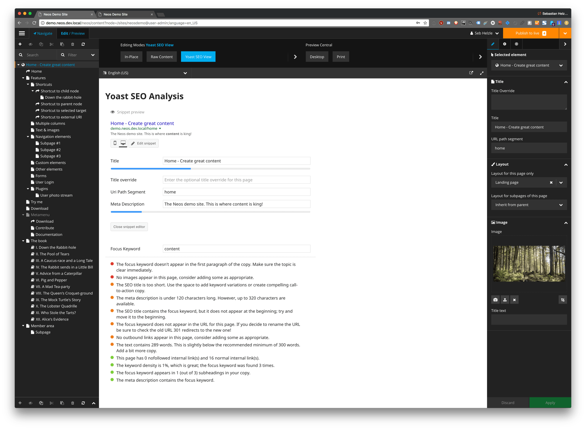

# Yoast SEO integration for Neos CMS

## What does it do

This package provides a new backend preview in [Neos CMS](https://neos.io) to look at your page with the help of the [Yoast SEO](https://github.com/Yoast/YoastSEO.js) plugin.

This view will show you a preview snippet how the selected page will look in the Google search results
and will give you insights and helpers to further improve the page for search engines.

These insights are generated via the official **Yoast SEO** javascript plugin.

**Attention!** This package is still an alpha version but you should be able to use it without 
problems as it just provides an additional view in Neos. 

## Example

 

## Installation

    composer require shel/neos-yoast-seo:dev-master
    
## Dependencies

This package currently only requires Neos 3.* but it's suggested to also have the `neos/seo` package installed.
This package expects some document node properties to be present like `titleOverride` and `metaDescription` which
are provided via the `neos/seo` package. But you can of course provide them yourself if you don't want to use
the `neos/seo` package.

## Configuration

In your `Settings.yaml` you can override the following options:

    Shel:
      Neos:
        YoastSeo:
          defaultContentLocale: en-US
          
### defaultContentLocale 

The analyzer will use the `lang` attribute rendered by the `Neos.Seo` package of your website to detect the 
language of your content. This option sets the default if `Neos.Seo` cannot detect it.
If no `lang` attribute is rendered the javascript part will use `en_US`.

Note that the html standard requires a `-` in the locale while Neos and Yoast internally use `_` and convert if needed. 

Check https://github.com/Yoast/YoastSEO.js#supported-languages for supported languages and the capabilities.
If you use a locale that Yoast doesn't understand don't expect perfect results. 

## Usage 

### Preview mode

After installation the new preview mode is available in the Neos backend which you can select form the `Edit / Preview` panel.

### Inspector

In the inspector a new group "Yoast" is added in the SEO-Tab with the following fields:

* focusKeyword: The main keyword this document is optimzed for. This is needed by yoast for calculating metrics.
* isCornerstone: Mark the document as exceptionally important for yoast. This will enforce more strict content-rules.

The group also contains a live analyzer which will check your content and SEO data and show you the results.
Depending on your nodetype configuration the analyzer will update after you change something and show you up-to-date
information without needing a reload of the whole page.  

## Notes about the packages capabilities

* The language of your content is used in the analyzer but the summaries are currently english only.
* We try to render your site as good as possible for the YoastSEO analyzer to parse it. This might not work for every usecase! 

## Contributing

* Contributions are very welcome. 
* Please open issues on Github if you have problems with the backend module or other Neos specific features.
* Please open issues on [Yoast SEO](https://github.com/Yoast/YoastSEO.js) if you have problems with the analyzer itself.
* Pull requests are even better!

### Building the assets

You can generate the `js` and `css` files by running the following commands in the package folder:

    npm install
    npm run build
    
Rebuilding the assets with browsersync when developing:

    npm run watch

### Roadmap

* Implement inspector view to see some feedback from Yoast plugin while editing a page
* Test plugin with various projects to check behavior
* Implement more features from the Yoast javascript library (Text reading ease, etc...)
* Nicer backend view
