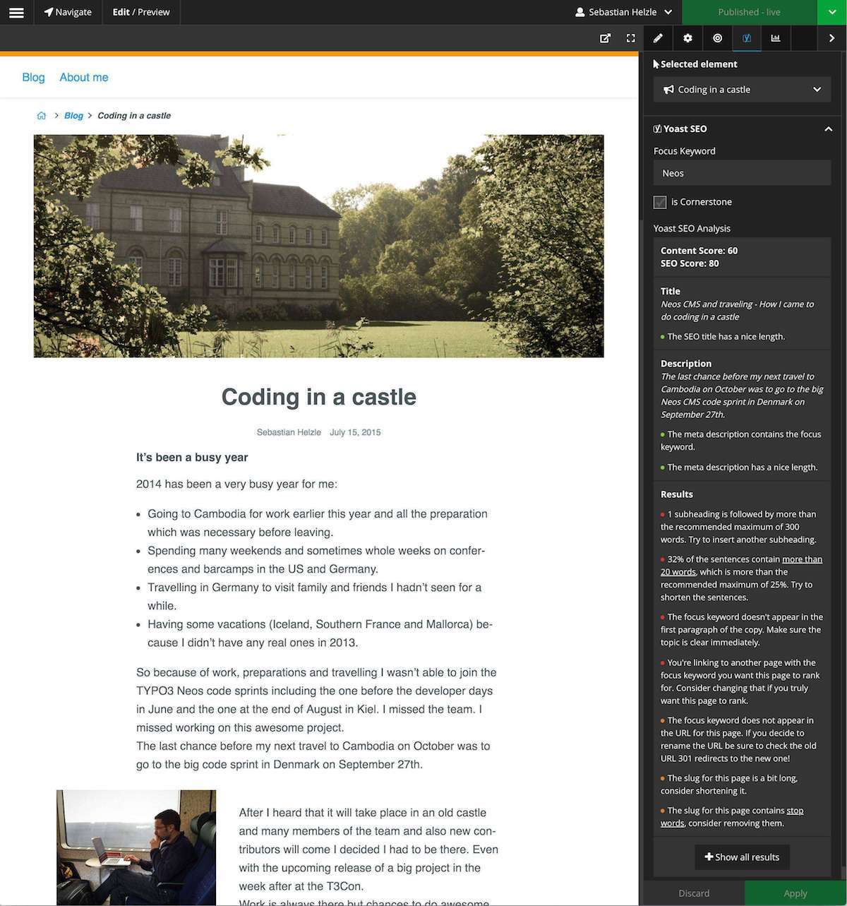

# Yoast SEO integration for Neos CMS

## What does it do

This package provides a new backend preview and inspector integration for [Neos CMS](https://neos.io) to look at 
your page with the help of the [Yoast SEO](https://github.com/Yoast/YoastSEO.js) plugin.

This view will show you a preview snippet how the selected page will look in the Google search results
and will give you insights and helpers to further improve the page for search engines.

These insights are generated via the official Open Source **Yoast SEO** javascript plugin by [Yoast](https://yoast.com).
But this package is in no other way supported or affiliated with *Yoast BV*,

We try to keep this package up-to-date with releases by Yoast but depending on the compatibility and available time 
this might take up to a few weeks after Yoast releases a new version of their library.

**Attention!** This package is still a pre-release version but you should be able to use it without 
problems as it just provides a additionals views in Neos. 

## Examples

 

 

## Installation

    composer require shel/neos-yoast-seo
    
## Dependencies

This package currently only requires Neos >= 3.0 but it's suggested to also have the `neos/seo` package installed.
This package expects some document node properties to be present like `titleOverride` and `metaDescription` which
are provided via the `neos/seo` package. But you can of course provide them yourself if you don't want to use
the `neos/seo` package.

## Configuration

In your `Settings.yaml` you can override the following options:

    Shel:
      Neos:
        YoastSeo:
          defaultContentLocale: en-US
          languageToLocaleMapping: [...]
          
### defaultContentLocale 

The analyzer will use the `lang` attribute rendered by the `Neos.Seo` package of your website to detect the 
language of your content. This option sets the default if `Neos.Seo` cannot detect it.
If no `lang` attribute is rendered the javascript part will use `en_US`.

Note that the html standard requires a `-` in the locale while Neos and Yoast internally use `_` and convert if needed. 

Check https://github.com/Yoast/YoastSEO.js#supported-languages for supported languages and the capabilities.
If you use a locale that Yoast doesn't understand don't expect perfect results. 

### languageToLocaleMapping

This array defines which translation should be used in the Yoast SEO analyzer depending on the selected interface
language of a Neos user.

See the `Settings.yaml` of this package and if you for example want a different version localized translation,
check out the folder `Resources/Private/Languages` and see which ones are supported and then update the mapping
accordingly.

For example the default mapping for `de` is `de_DE` but can be changed to Swiss German with the following configuration:

    Shel:
      Neos:
        YoastSeo:
          languageToLocaleMapping: 
            de: 'de_CH'

## Usage 

### Preview mode

After installation the new preview mode is available in the Neos backend which you can select form the `Edit / Preview` panel.

This is useful to check several pages after another and optimize SEO properties.
The preview also shows a preview how a page could look as Google search result.

### Inspector

In the inspector a new group "Yoast" is added in the SEO-Tab with the following fields:

* focusKeyword: The main keyword this document is optimzed for. This is needed by yoast for calculating metrics.
* isCornerstone: Mark the document as exceptionally important for yoast. This will enforce more strict content-rules.

The group also contains a live analyzer which will check your content and SEO data and show you the results.
Depending on your nodetype configuration the analyzer will update after you change something and show you up-to-date
information without needing a reload of the whole page.  

This view is helpful when optimizing a single page while working on it's content.

## Notes about the packages capabilities

* The language of your content is used in the analyzer but the summaries are currently english only.
* We try to render your site as good as possible for the YoastSEO analyzer to parse it. This might not work for every usecase! 

## Contributing && issues

* Contributions are very welcome. 
* Pull requests are even better!
* Please open issues for [this project](https://github.com/Sebobo/Shel.Neos.YoastSeo/issues) if you have problems with the backend module or other Neos specific features.
* Please open issues for [Yoast SEO](https://github.com/Yoast/YoastSEO.js) if you have problems with the analyzer itself or translations of any hints and warnings generated by the analyzer.

### Building the assets

You can generate the `js` and `css` files by running the following commands in the package folder:

    yarn install
    yarn run build-all
    
#### Building and watchting the app for the edit mode
    
    yarn run build-app
    
    yarn run watch-app
    
#### Building and watching the inspector view

    yarn run build-inspector
    
    yarn run watch-inspector

### Roadmap

* Test plugin with various projects to check behavior
* Implement more features from the Yoast javascript library (Text reading ease, etc...)
* Nicer backend view
